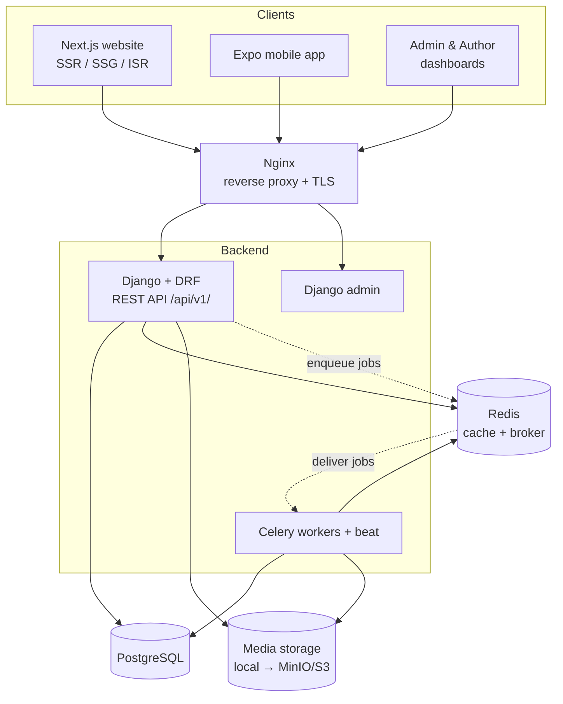

# Architecture — Flash News Platform

High-level system architecture. Teaching-level explanations of each concept live
in [`teaching/29-system-design/`](../teaching/29-system-design/README.md).

## 1. The big picture

## 2. Style: modular monolith

One deployable Django backend, internally split into **apps** (bounded contexts):
`accounts`, `articles`, `categories`, `media`, `videos`, `galleries`,
`livecoverage`, `ads`, `newsletters`, `notifications`, `comments`, `analytics`.

Why a monolith (not microservices) to start:
- One repo, one deploy, one database → cheapest to run on a single VPS.
- Apps stay loosely coupled (no cross-app model imports; communicate via services
  / signals), so pieces *can* be extracted later if scale demands it.

## 3. Request lifecycle (Phase 2+ API)

1. Client sends an HTTPS request → **Nginx** terminates TLS, forwards to Django
   (via Gunicorn).
2. Django routing matches a URL to a DRF **view**.
3. Auth/permission classes check the JWT and RBAC role.
4. The view calls a **service** / the ORM → **PostgreSQL** (often via a **Redis**
   cache for hot reads).
5. A **serializer** turns model objects into JSON. Nginx sends it back.

Heavy or slow work (image/video processing, sending notifications, generating
sitemaps) is *not* done in the request — it's pushed onto **Redis** as a Celery
job and handled by a **worker** in the background.

## 4. Cost-first infrastructure choices

| Concern | Choice | Why |
|---------|--------|-----|
| Orchestration | Docker Compose (no k8s) | Runs on one small VPS |
| TLS | Let's Encrypt via Nginx/certbot | Free certificates |
| Media | Local disk → MinIO (S3 API) | Free now, portable later |
| Search | Postgres full-text → OpenSearch | No extra service until needed |
| Cache/broker | Single Redis | One process serves both roles |

## 5. Scaling path (later, only if needed)

- Add read replicas for Postgres; put a CDN in front of media + cached pages.
- Run multiple Gunicorn/Celery containers behind Nginx as a load balancer.
- Extract the highest-traffic app into its own service.

## 6. Current status

Phase 1 delivered the **data layer** (models, migrations, admin) and this
architecture blueprint. The API (Phase 2), media pipeline (Phase 3), and
everything client-facing are built in subsequent phases per
[`../PLAN.md`](../PLAN.md).
