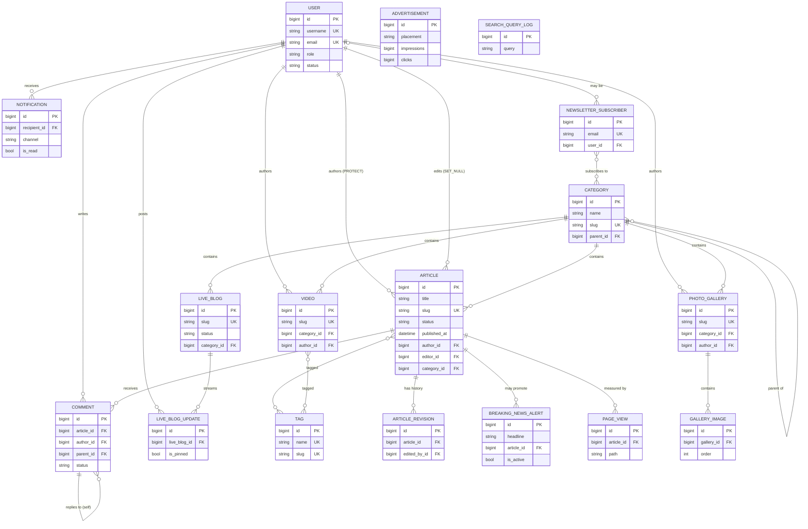

# Database ERD — Flash News Platform (Phase 1)

Entity-Relationship Diagram of the Phase 1 schema. Rendered with Mermaid (GitHub
and most markdown viewers display it natively). Per-table detail lives in
[`teaching/30-database-design/`](../teaching/30-database-design/README.md).

## Legend

- `||--o{` one-to-many · `}o--o{` many-to-many · self-loops = self-referential FK.
- `PK` primary key · `FK` foreign key · `UK` unique.
- `ADVERTISEMENT` and `SEARCH_QUERY_LOG` have no foreign keys to the rest of the
  graph (standalone), so they appear without relationship lines.

## Notes

- The many-to-many links (`ARTICLE ↔ TAG`, `VIDEO ↔ TAG`, `SUBSCRIBER ↔
  CATEGORY`) are realized by hidden join tables Django creates automatically.
- `on_delete` rules are documented per relationship in
  [`teaching/30-database-design/00-conventions.md`](../teaching/30-database-design/00-conventions.md).
