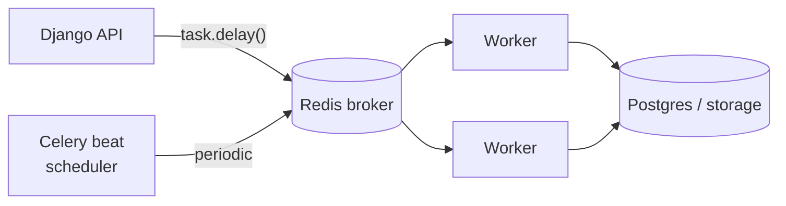

# What is Celery?

**Topic:** Celery · **Level:** Beginner → Intermediate
**Prerequisites:** [`../08-redis/01-what-is-redis.md`](../08-redis/01-what-is-redis.md)

## 1. The idea in one sentence

> Celery runs slow or scheduled work **outside** the web request, in separate
> worker processes, so the API can answer immediately.

## 2. Analogy

A restaurant kitchen: the **waiter** (your Django view) takes the order and
returns to the customer fast. It doesn't stand at the stove. The **cooks**
(Celery workers) prepare the slow dishes in the back. The **order rail** where
tickets hang is the **broker** (Redis).

## 3. Why we need it here

Some jobs are too slow to do while a user waits:

- Resize an uploaded photo into 4 sizes × 2 formats.
- Transcode a video to HLS (can take minutes).
- Email 50,000 newsletter subscribers.

And some jobs have no user at all — they're **scheduled**:

- Every minute: publish articles whose scheduled time arrived.
- Nightly: roll raw analytics into daily summaries.

Celery handles both: **on-demand** tasks and **periodic** tasks.

## 4. The moving parts



| Part | Job | In this repo |
|------|-----|--------------|
| **Task** | a function that can run in the background | `@shared_task` functions in each app's `tasks.py` |
| **Broker** | the queue holding pending tasks | Redis (`CELERY_BROKER_URL`) |
| **Worker** | process that runs tasks | `celery -A config worker` |
| **Beat** | scheduler that enqueues periodic tasks | `celery -A config beat` |

## 5. Calling a task

```python
from apps.media.tasks import generate_image_renditions

generate_image_renditions.delay(article.featured_image.name)   # returns instantly
```

`.delay(...)` doesn't run the function — it drops a message on the broker and
returns. A worker picks it up moments later. The web request already moved on.

## 6. Running it locally

```bash
# Terminal 1: the databases
docker compose -f infrastructure/docker-compose.dev.yml up -d
# Terminal 2: a worker
cd backend && uv run celery -A config worker -l info
# Terminal 3: the scheduler (for periodic tasks)
cd backend && uv run celery -A config beat -l info
```

In **tests** we skip all that: `CELERY_TASK_ALWAYS_EAGER = True` makes tasks run
inline, so no worker/broker is needed (see `conftest.py`).

## 7. Common mistakes

- Calling `task(...)` (runs inline, blocking) when you meant `task.delay(...)`.
- Passing whole model objects to a task — pass the **id** and re-fetch inside
  (objects don't serialize cleanly and may be stale). Our tasks take ids/paths.
- Forgetting a worker is running, then wondering why nothing happens.

## 8. Interview questions

- **Junior:** Why move work off the web request?
- **Mid:** Broker vs worker vs beat — what does each do?
- **Senior:** Why pass ids instead of objects to tasks? What about idempotency
  and retries?

← [Celery topic index](README.md)
