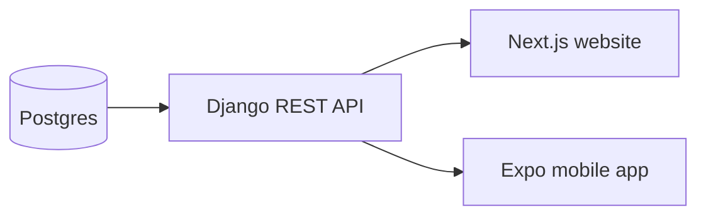

# 22 · Mobile Architecture

**Status:** 🟢 Built — see [`mobile/`](../../mobile/).

How the Flash mobile app is organised — and the one big idea: it's a **second
frontend over the same API**, not a second backend.

## 1. One backend, two frontends



The website ([`web/`](../../web/)) and the app ([`mobile/`](../../mobile/)) both
call the same `/api/v1/...` endpoints. The mobile [`api.ts`](../../mobile/src/lib/api.ts)
is a slimmer twin of the web one, and [`types.ts`](../../mobile/src/lib/types.ts)
mirrors the same serializer shapes. Change a serializer once → both clients see
it. This is the payoff of an API-first design (see [10-api-design](../10-api-design/)).

## 2. The layers

```
src/
  app/          Routes (Expo Router). Screens read params, call hooks, render.
  components/    Reusable UI: ArticleCard, HeroCard, BreakingBanner, StateView.
  lib/           Non-UI logic:
    api.ts       fetch wrappers → typed data (throws on error)
    types.ts     API JSON shapes
    env.ts       per-platform API base URL
    utils.ts     mediaUrl, formatDate, htmlToParagraphs
    bookmarks.ts AsyncStorage read/write
```

Rule of thumb: **screens orchestrate, components render, `lib` does logic.** A
screen shouldn't hand-build a fetch URL; it calls `api.listArticles()`.

## 3. Data fetching with TanStack Query

Every screen fetches with `useQuery`, so we get caching, loading/error states,
and pull-to-refresh almost for free — the same library the website uses:

```tsx
const { data, isPending, isError, refetch, isRefetching } = useQuery({
  queryKey: ["articles", "latest"],
  queryFn: () => api.listArticles(),
});
if (isPending) return <Loading />;
if (isError) return <ErrorView />;
```

The `queryKey` identifies the cache entry (e.g. `["article", slug]`), so
revisiting a screen shows cached data instantly, then revalidates.

## 4. Offline & local state: AsyncStorage

Bookmarks live on the device via `AsyncStorage` (a small async key–value store),
so the **Saved** tab works with no network. We store the lightweight
`ArticleListItem` (title, image, excerpt) — enough to render the list offline:

```ts
// bookmarks.ts
await AsyncStorage.setItem("flash:bookmarks", JSON.stringify(next));
```

The Saved screen reloads on focus (`useFocusEffect`) so a bookmark toggled on the
article screen shows up immediately.

## 5. Rendering article HTML without a web view

Article bodies are HTML from the CMS. Rather than ship a heavy HTML engine, we
convert to text paragraphs on device (`htmlToParagraphs` in `utils.ts`) and
render `<Text>` blocks — fast and dependency-free. The featured image is shown
separately via `expo-image`. (For rich inline media later, `react-native-render-html`
or a `WebView` are the upgrade path.)

## 6. Where this goes next (Phase 6 backlog)

The MVP covers home, categories, search, article, and offline saves. Still open
from the original Phase 6 scope: push **notifications** (`expo-notifications`),
**video/live** playback (`expo-av` + the videos/livecoverage APIs), and infinite
scroll. Each reuses an existing API endpoint — no backend work.

## Exercises

- **Beginner:** Add a "Videos" tab backed by `api.listVideos()`.
- **Intermediate:** Cache full `Article` bodies on bookmark so saved articles are
  fully readable offline (not just the summary).
- **Advanced:** Add optimistic bookmark toggling with a Query mutation +
  `queryClient` cache update, and reconcile with AsyncStorage.

## Quiz

1. Why don't we build a separate backend for the app?
2. What does a TanStack Query `queryKey` control?
3. Why is `AsyncStorage` the right tool for bookmarks but not for the article
   feed?

<details><summary>Answers</summary>

1. The Django REST API already serves everything; the app is just another
   client — one source of truth, no duplication.
2. It's the cache identity — same key = shared cached result; changing it fetches
   fresh data.
3. Bookmarks are small, user-owned, and needed offline; the feed is large,
   shared, and server-owned (fetch + cache with Query instead).
</details>

← Back to the [curriculum index](../README.md)
