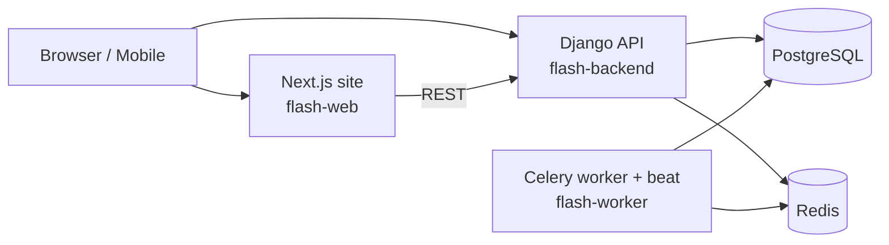

# Deploying the platform on Render (Phase 8)

This lesson explains **how the app goes from "runs on my laptop" to "live on the
internet"** using Render, and the production concepts behind each file. Pair it
with the operational steps in the repo-root [DEPLOYMENT.md](../../DEPLOYMENT.md).

## The shape of a production deploy

A dev setup is one process (`runserver`) + a local DB. Production splits into
independent, restartable pieces, each doing one job:

Why separate services?
- **The web server and the background worker scale and fail independently.** A
  slow image job shouldn't block a reader's request.
- **Redis** is both the Celery *broker* (the to-do list of tasks) and the Django
  cache.
- **Beat** is the scheduler that enqueues periodic tasks (publish scheduled
  articles every minute; roll up analytics nightly).

## Infrastructure as code: `render.yaml`

Instead of clicking through a dashboard, the whole stack is declared in one file
(a **Blueprint**). Benefits: it's version-controlled, reviewable, and
reproducible. Key ideas in ours:

- `fromDatabase` / `fromService` inject the DB and Redis connection strings into
  each service — no copy-pasting secrets.
- `generateValue: true` makes Render mint a strong `SECRET_KEY`.
- `sync: false` marks values a human must fill once (the cross-service public
  URLs — a chicken-and-egg that no config file can know in advance).
- `preDeployCommand` runs migrations **before** each new version serves traffic.
- A `disk` gives the backend persistent storage for uploads.

## Why containers (Docker)?

Each app ships a **Dockerfile** so the exact runtime — OS libraries, Python/Node
version, dependencies — is baked in and identical everywhere. Two production
patterns worth learning from them:

1. **Backend** ([backend/Dockerfile](../../backend/Dockerfile)):
   - Dependencies are installed in their own layer (`COPY pyproject.toml uv.lock`
     before the code) so rebuilds are fast when only code changes — **layer
     caching**.
   - `collectstatic` runs at *build* time; **WhiteNoise** then serves those
     hashed, far-future-cached files straight from the app, so we don't need a
     separate nginx just for static assets.
   - The app is served by **gunicorn** (a robust process manager) running a
     **uvicorn** ASGI worker — never `runserver`, which is single-threaded and
     insecure for production.

2. **Frontend** ([web/Dockerfile](../../web/Dockerfile)):
   - **Multi-stage build**: install deps → build → copy only the result into a
     tiny runtime image. Next's `output: "standalone"` traces just the files the
     server needs, so the final image isn't carrying the whole `node_modules`.
   - `NEXT_PUBLIC_*` values are **inlined at build time**, so they're passed as
     Docker **build args** (Render forwards env vars to the build). This is why
     changing them requires a rebuild, not just a restart.

## Twelve-factor config & the DEBUG boundary

Settings read everything from the environment (`django-environ`), never
hard-coded. The single most important production switch is `DEBUG=False`, which:
- turns on HTTPS redirect, HSTS, and secure cookies (gated on `not DEBUG`),
- switches static storage to hashed/compressed manifest files,
- makes error pages non-revealing.

We add a **fail-fast guard**: booting with `DEBUG=False` *and* the shared
insecure dev `SECRET_KEY` raises immediately — you can't accidentally ship a
forgeable-cookie key.

## What must NOT ship

- **Secrets**: `.env*` files are git-ignored; only `*.env.example` templates are
  committed. Render holds real secrets as env vars.
- **Non-app folders**: `teaching/`, `docs/`, `mobile/`, and the audit reports
  live outside the `./backend` and `./web` build contexts, so they never enter
  an image. `.dockerignore` strips caches, tests, and local data on top.

## Common mistakes

- Using `runserver` / `next dev` in production (both are dev-only).
- Forgetting that `NEXT_PUBLIC_*` are build-time — setting them after the build
  and wondering why the site still calls `localhost`.
- Putting production data on a free database that later expires.
- Serving user media from an ephemeral container filesystem (it vanishes on
  redeploy) instead of a disk or object storage.

## Exercises

1. **(Beginner)** In `render.yaml`, which field guarantees migrations run before
   a new backend version takes traffic? What breaks if you remove it?
2. **(Intermediate)** Explain why `NEXT_PUBLIC_SITE_URL` is a Docker build arg
   but `DATABASE_URL` is only a runtime env var.
3. **(Advanced)** Sketch the change needed to run 3 backend instances behind
   Render's load balancer. (Hint: what is the disk doing, and what must media
   storage become?)

## Quiz

1. What two roles does Redis play in this stack?
2. Why does the backend image run `collectstatic` at build time?
3. What does `DEBUG=False` switch on besides hiding error details?
4. Why are `teaching/` and `mobile/` never in the deployed images?

Answers

1. Celery message **broker** and Django **cache**.
2. So WhiteNoise can serve pre-hashed, compressed static files from the app with
   long-lived caching — no nginx/CDN required for them, and no work at request time.
3. HTTPS redirect, HSTS, secure/HTTP-only cookies, and hashed-manifest static
   storage (all gated on `not DEBUG`), plus the insecure-`SECRET_KEY` guard.
4. They're outside the `./backend` and `./web` Docker build contexts (and
   `.dockerignore`'d), so Docker never receives them.

