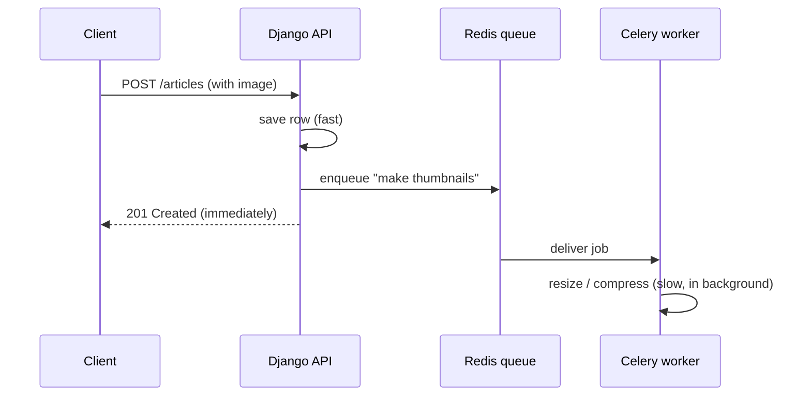

# Architecture Overview

**Topic:** System Design · **Level:** Beginner → Intermediate

## 1. The idea in one sentence

> Our system is a **client–server** application: many clients (website, mobile
> app, dashboards) talk over HTTP to one backend server that owns the data.

## 2. Analogy

Think of a restaurant. **Clients** are diners. The **API** is the waiter taking
orders in a fixed format. The **kitchen** is the backend doing the work. The
**pantry** is the database. Slow tasks (a cake that needs 2 hours) go to a **prep
team in the back** (background workers) so the waiter isn't blocked.

## 3. The pieces

See the full diagram in [`docs/architecture.md`](../../docs/architecture.md).

- **Clients** — Next.js website, Expo mobile app, admin/author dashboards.
- **Nginx** — the front door: terminates HTTPS and forwards requests.
- **Django + DRF** — the backend that answers API requests.
- **PostgreSQL** — the durable database (source of truth).
- **Redis** — fast in-memory cache *and* the queue for background jobs.
- **Celery** — workers that do slow tasks off the request path.
- **Media storage** — uploaded images/videos (local disk now, S3-compatible
  later).

## 4. Why "modular monolith"

We run **one** backend, split inside into independent **apps** (accounts,
articles, …). It's the cheapest thing to operate (one VPS) while staying
organized enough to split apart later if traffic demands. Contrast:

- *Monolith* = one deployable. Simple, cheap. ← we are here.
- *Microservices* = many small deployables. Flexible but complex/expensive.

## 5. Request vs background work

The single most important system-design habit: **keep the request fast.** If a
user action triggers slow work (resize an image, transcode a video, email 10,000
subscribers), don't do it while they wait — enqueue a job and respond
immediately. That's the Redis + Celery path.

## 6. Diagram: sync vs async

## 7. Exercises

- **Beginner:** List which parts of our stack are "clients" and which are
  "servers."
- **Intermediate:** Give three tasks that should run in the background rather
  than during the request, and say why.

## 8. Interview questions

- **Junior:** What is client–server architecture?
- **Mid:** Why offload work to a background queue? What can go wrong if you don't?
- **Senior:** When would you break this monolith into services, and what would
  you extract first?

← [System Design index](README.md)
