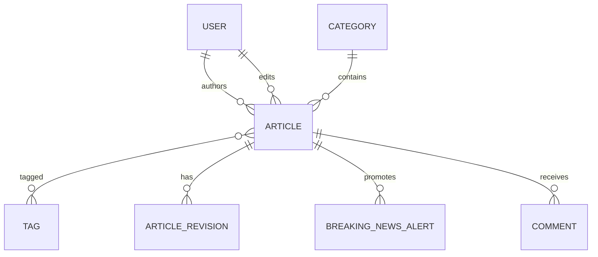

# Tables: Articles

Real code: [`apps/articles/models.py`](../../backend/apps/articles/models.py).
See also the model deep-dive:
[`05-django/models/article-model-explained.md`](../05-django/models/article-model-explained.md).

Three tables live in the articles app.

## Table: `articles_article`

The central content table. Key columns:

| Column | Type | Purpose |
|--------|------|---------|
| `title`, `subtitle` | varchar | headline + standfirst |
| `slug` | slug, unique | URL identifier |
| `excerpt` | text | summary shown in lists/cards |
| `content` | text | full HTML body (from the Tiptap editor) |
| `author_id` | FK→user (PROTECT) | who wrote it |
| `editor_id` | FK→user (SET_NULL) | who edited it (optional) |
| `category_id` | FK→category (PROTECT) | its section |
| `featured_image`, `image_caption`, `source` | media/credit | |
| `status` | enum | draft/review/scheduled/published/archived |
| `published_at` | datetime, indexed | go-live time (future = scheduled) |
| `reading_time` | int | estimated minutes |
| `views`, `shares`, `reactions` | bigint | denormalized counters |
| `is_breaking`, `is_featured` | bool, indexed | promotion flags |
| + `SEOFields` + `TimeStampedModel` | | seo/meta + timestamps |

**Many-to-many:** `tags` ↔ `articles_article_tags` join table ↔ `categories_tag`.

**Indexes:** `(status, published_at)` and `(category, status)` — the two hottest
query shapes (homepage feed, category feed).

**Managers:** `objects` (all) and `published` (only live). Public reads must use
`published` so drafts never leak.

## Table: `articles_articlerevision`

Append-only history for draft recovery and "who changed what."

| Column | Purpose |
|--------|---------|
| `article_id` | FK→article (**CASCADE** — history dies with the article) |
| `edited_by_id` | FK→user (SET_NULL) |
| `title/subtitle/excerpt/content` | a full snapshot at save time |
| `note` | optional change summary |

We store full snapshots (not diffs) so "restore this version" is a trivial copy.

## Table: `articles_breakingnewsalert`

A promoted, time-boxed banner.

| Column | Purpose |
|--------|---------|
| `headline` | banner text |
| `article_id` | FK→article (CASCADE), optional |
| `external_url` | link out instead of to an internal article |
| `is_active`, `starts_at`, `expires_at` | scheduling window |

Editors schedule and auto-retire banners via the time window instead of
deleting rows (keeps a history).

## Diagram

## Exercises

- **Beginner:** Which `on_delete` does `author` use, and why not `CASCADE`?
- **Intermediate:** Write the ORM query for "the 10 most recent published
  articles in the Politics category." (Hint: `Article.published.filter(...)`.)
- **Advanced:** Design how you'd populate `views` without a write on every page
  load. (Hint: batch increments / Celery — Phase 3.)

## Interview questions

- **Junior:** What does the `status` column model?
- **Mid:** Why keep revisions as full snapshots vs diffs? Trade-offs?
- **Senior:** How would you keep `(category, status, published_at)` queries fast
  as the table grows to tens of millions of rows?

← Back to the [Database Design index](README.md)
