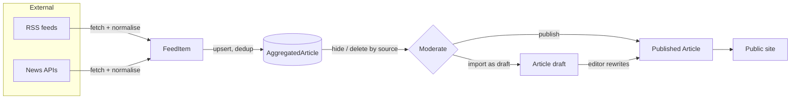

# What is news aggregation?

**News aggregation** is pulling headlines published by *other* newsrooms into
your own system, so an editor can see everything in one place and decide what to
surface. A "Google News" or "AllAfrica" is a pure aggregator; a newsroom like
Flash aggregates as a *research and sourcing* tool — a feed of what's breaking
elsewhere that editors can moderate, and either link out to or turn into their
own original coverage.

This lesson explains the ideas; the [file explainers](README.md) walk the code.

## 1. The golden rule: metadata + a link, not the full article

You may **not** copy another outlet's full article text and republish it as
your own — that's copyright infringement. What you *can* do is store the
**headline, a short summary, the lead image, the author, the publish time, and a
link back to the original**. That's exactly what publishers put in their RSS
feeds *for this purpose*.

So `AggregatedArticle` deliberately stores only that syndication-shaped
metadata. When an editor "publishes" an aggregated item to the Flash site, we
create a normal `Article` from the summary, keep a **source credit**
(`Article.source = "BBC News"`), and it becomes the newsroom's own short post —
the starting point an editor is expected to expand, not a verbatim copy.

> Rule of thumb: aggregate the *pointer*, not the *payload*.

## 2. Two ways to get the news: RSS vs APIs

| | RSS feed | News API |
|---|---|---|
| What | An XML document a site publishes at a URL | A JSON HTTP endpoint |
| Auth | None | An API key |
| Cost | Free | Free tier + paid |
| Examples | BBC, CNN, Al Jazeera, Guardian, Nation | NewsAPI.org, GNews, NewsData.io |
| Stability | Very stable; built for syndication | Stable, but rate-limited |

Flash uses **RSS as the primary mechanism** (zero config, zero cost, and it's
what publishers *want* you to use) and treats news APIs as an optional bonus
that activates only when a key is present. Both are reduced to one internal
shape — a `FeedItem` — so the rest of the pipeline never cares where a story
came from. See [fetchers-explained.md](project-files/fetchers-explained.md).

### What about sites with no RSS?

Some outlets (e.g. The Star, Citizen) dropped their public feeds. Two fallbacks,
in order of preference:

1. **News sitemap.** Most sites keep a `sitemap-news.xml` (direct article URLs +
   titles + dates + images) for Google News SEO, even after dropping RSS. We
   parse it exactly like a feed. *Citizen* uses this — and because the URLs are
   direct, full-body extraction works. (Find it via `/sitemap.xml` or the
   `Sitemap:` line in `robots.txt`.)
2. **Google News RSS**, scoped to one site —
   `news.google.com/rss/search?q=site:the-star.co.ke`. This always works for
   *headlines*, but the item links are opaque `news.google.com/rss/articles/…`
   redirects, **not** the article — so a server-side extractor can't read the
   body from them directly. *The Star* uses this; to get full text we **decode**
   each link back to the real `the-star.co.ke` URL via Google's own
   `batchexecute` endpoint (see `google_news.py`) before extracting.

The lesson: *how you discover a source dictates whether full extraction is even
possible.* Direct URLs (RSS, sitemap) → yes. Redirect wrappers → only after
resolving them.

## 2b. Full article bodies: extraction (beyond the summary)

RSS/API give a *summary*. To ingest a **whole** article you must fetch the
article page and pull the body out of the surrounding site chrome (nav, ads,
related-links, comments). Doing that by hand per-site is madness; instead we use
a **readability/extraction** library — `trafilatura` — which is trained to find
"the article" on an arbitrary news page. See
[fetchers-explained.md](project-files/fetchers-explained.md) and `extract.py`.

Design choices that matter:

- **On demand, not during ingestion.** Extraction is one HTTP request *per
  article* — fetching 250 pages in a synchronous run would time out. So the run
  stays fast (summaries), and the full body is pulled when you **Publish/Import**
  an item, or via an explicit **"Fetch full content"** action. The result is
  cached on the row (`content`, `content_fetched`).
- **Clean, escaped paragraph HTML.** We store the extracted *text* wrapped in
  `<p>` and HTML-escaped — never the site's raw markup. That kills any scripts,
  trackers, or broken relative links, and is safe to render.
- **Paywalls degrade gracefully.** A genuinely gated page returns only a teaser
  or boilerplate. Any extraction under a word-count threshold is discarded and
  the import falls back to the feed summary — so we never store junk. A source
  known to be hard-paywalled can be flagged `paywalled=True` to skip the fetch
  entirely (an escape hatch; currently unused — see the note below).

> **"Is it really paywalled?" — test, don't assume.** We first flagged Nation
> and Standard as paywalled off one bad extraction and a "register to continue"
> banner. On inspection both actually ship the **full article body in the page
> HTML** (the banner is just a soft overlay), so both extract fine and are *not*
> flagged. The lesson: verify with the real page — check whether the body is in
> the HTML (view-source / a `<script type="application/ld+json">` `articleBody`),
> whether there's an AMP version, and whether "premium" text is a real wall or a
> cosmetic nag — before writing a source off.
- **This crosses a line.** Headline+link aggregation is broadly accepted; storing
  and republishing full bodies is a real copyright decision only the site owner
  can make, per-source. The data model encodes the caution (summary by default,
  full body opt-in, source credit always kept).

## 3. Never scrape HTML *by hand* if you can help it

You *could* download a site's HTML and parse the article out of the page. Avoid
it: page markup changes without warning (your parser breaks weekly), it's a
heavier legal grey area, and it's slow. RSS/APIs are contracts meant for
machines; HTML is a contract meant for eyeballs. Prefer the machine contract.

## 4. De-duplication: the one hard part

Run ingestion twice and BBC's feed still lists the same 20 stories — you must
not create 40 rows. Each item carries a **stable identity**: the feed's `guid`
(or the URL as a fallback). We enforce uniqueness on `(source, external_id)` and
*upsert*: insert if new, update if seen before.

```python
AggregatedArticle.objects.update_or_create(
    source=source.slug, external_id=item.external_id, defaults={...}
)
```

That single call is the entire dedup strategy — the database guarantees it via a
`UniqueConstraint`, so even a race can't create a duplicate.

## 5. The workflow: ingest → moderate → promote



- **Ingest** — admin picks sources + a per-source cap, runs it; a dead feed is
  recorded, never fatal. Every run writes an `IngestionRun` audit row.
- **Moderate** — hide or delete everything from a noisy source; records stay in
  the DB when hidden, are removed when deleted.
- **Promote** — one item → a **draft** (editor rewrites) or straight to a
  **published** post (source credit kept, outbound link dropped). Or select many
  and bulk-publish.

Nothing is public until an editor promotes it: the aggregation store lives
entirely behind the staff dashboard.

## 6. Why run synchronously (for now)?

The admin "Start ingestion" button calls the API and *waits* for the report,
like the reference job-board panel. That's fine for ~10 feeds and gives instant
feedback. The same `run_ingestion()` function is also wrapped in a Celery task
(`run_scheduled_ingestion`) so a newsroom can schedule periodic pulls later —
the logic is written once and reused. See [09-celery](../09-celery/).

## Exercises

- **Beginner:** Add a new international RSS source (e.g. NPR:
  `https://feeds.npr.org/1001/rss.xml`) to the registry in `sources.py` and
  dry-run it. Why does a bad URL not crash the whole run?
- **Intermediate:** The publish path stores `content = "<p>{summary}</p>"`.
  Change `import_to_article` to also set the article's first `Tag` from the
  source region. What breaks if two items produce the same slug, and how does
  `_unique_slug` prevent it?
- **Advanced:** Add a `last_seen_at` field and a beat task that deletes
  aggregated items older than 30 days that were never imported. Which index
  makes that query cheap?

## Quiz

1. Why do we store a summary + link instead of the full article body?
2. What column pair guarantees we never store the same story twice?
3. An API source has no key configured — what does ingestion do?
4. After you "publish" an aggregated item, does the public post link back to the
   original? Why or why not?
5. Where would you add a source that has no RSS feed at all?

<details><summary>Answers</summary>

1. Copyright — you may syndicate metadata + a pointer, not republish the payload.
2. `(source, external_id)`, enforced by a `UniqueConstraint` + `update_or_create`.
3. It's reported as *unavailable* and skipped (recorded in the run detail), never
   an error.
4. No — the newsroom chose to drop the outbound link and keep only a source
   *credit*, making it their own short post to expand.
5. Use a Google-News-per-site RSS query in `sources.py`, or a news API.
</details>

## Interview questions

- **Junior:** What's the difference between an RSS feed and a REST API for news?
- **Mid:** How would you design de-duplication for a job/news aggregator that
  polls the same sources every hour?
- **Senior:** Walk through the copyright, caching, and failure-isolation
  trade-offs of a news aggregation pipeline. Where do you draw the line between
  aggregation and republishing, and how does the data model encode that line?

← [Topic index](README.md)
