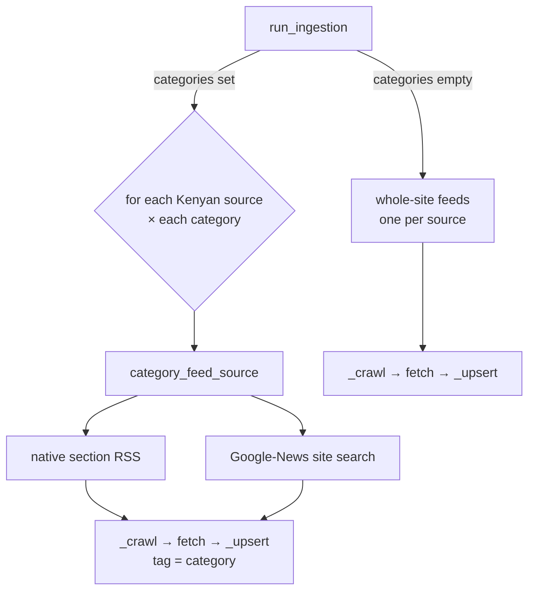

# Category-scoped crawling

Sometimes you don't want *everything* a newsroom publishes — you want one
section. "Pull only **Sports** from The Star, Nation, Standard and Tuko." This
lesson explains how the aggregator does that, building on
[01 — what is aggregation](01-what-is-aggregation.md).

## Two ways to get a section feed

A publisher can expose a section two ways, and we handle both (`sources.py`):

1. **Native section RSS** — the site publishes a feed per section, e.g.
   `standardmedia.co.ke/rss/sports.php` or `tuko.co.ke/rss/sports.rss`. Richest
   and most reliable (full 25–30 items). We keep a verified map of these in
   `NATIVE_CATEGORY_FEEDS`.
2. **Google-News site search** — for sites without a clean section feed (Nation,
   The Star, Citizen, Kenyans), we ask Google News for recent articles from that
   domain matching the section's keywords:
   `news.google.com/rss/search?q=when:7d site:the-star.co.ke (sports OR football …)`.
   Uniform (works for any site), slightly noisier, 7-day window. The URLs it
   returns are decoded back to the real article at extraction time (see
   `google_news.py` / `extract.py`), exactly like The Star's base feed.

`category_feed_source(base_slug, category_slug)` resolves the right one: native
if we have it, else the Google-News fallback. It returns a **synthetic `Source`**
that keeps the publisher's slug and name (so items stay attributed to "The
Standard") but points at the section feed.

> Design idea: a `Source` is just "a slug + name + a URL to parse". Because
> category feeds are the same shape, we reuse the *entire* existing fetch →
> upsert → extract pipeline unchanged; only the URL differs.

## Tagging and auto-filing

When you crawl by section, each `AggregatedArticle` is stored with a `category`
tag (e.g. `"sports"`). That tag then flows through:

- **Import** (`import_to_article`) and **synthesis** (`_create_draft`) resolve the
  editorial section as `explicit choice → item's crawled category → default`. So
  a sports-crawled item, imported with the picker on **Auto**, lands in the
  Sports section with no manual step.
- The admin picks **"Auto — by crawled section"** by default; choosing a real
  section still overrides it.

## The run flow

`run_ingestion(slugs, categories=…)` branches:

Non-Kenyan / API sources are skipped in category mode (they aren't in
`GNEWS_DOMAIN`). One dead section feed is recorded in the run report and never
aborts the run — same resilience as whole-site ingestion.

## Exercises

1. **Beginner** — Standard exposes `business`, `politics`, `sports`,
   `entertainment` natively but not `technology`. Which mechanism serves a
   Standard *technology* crawl, and where is that decided in
   `category_feed_source`?
2. **Intermediate** — Why does `_upsert` only *set* a category when one is
   passed, never clear it? What would break if a later whole-site run cleared it?
3. **Advanced** — The Google-News fallback uses keyword matching
   (`site:domain (sports OR football)`), which can pull the odd off-topic
   article. Sketch two ways to tighten precision (hint: URL path scoping vs.
   post-filtering on the section), and the trade-offs of each.

Solutions

1. The Google-News fallback — `NATIVE_CATEGORY_FEEDS["standard"]` has no
   `technology` key, so `.get(...)` returns None and we fall through to
   `_gnews_feed`. 2. An item can be crawled both by section and by the whole-site
   feed; clearing on the whole-site pass would drop the section tag and lose
   auto-filing. 3. (a) `site:domain/sports/` path scoping — precise where the
   site uses section paths, but path patterns vary per publisher. (b) Fetch wider
   then drop articles whose resolved URL isn't under the section path — precise
   but costs an extra fetch/decode per item.

