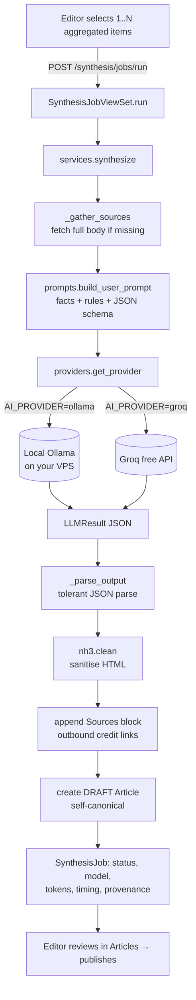
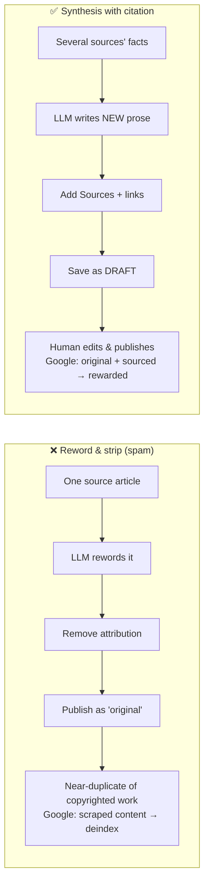

# 41 — AI content synthesis

This track covers the **AI Synthesis** feature: turning one or more *aggregated*
headlines (from track [40 — news aggregation](../40-news-aggregation/README.md))
into a single **original, cited draft article** using a locally-hosted LLM.

It is the answer to a very common — and very dangerous — request:

> "Can I use AI to reword the articles I scraped from other sites, and strip out
> anything that links them back to the source, so search engines can't tell?"

The short answer is **no, don't do that** — it's the fastest way to get a site
**deindexed** by Google and sued for copyright. But the *goal behind* the
question — "use AI to turn other outlets' reporting into content for my site" —
is achievable and legitimate, if you do it the right way. That right way is
**synthesis with citations**, and it's what this feature implements.

## Lessons

1. [00 — Why synthesis, not paraphrase](00-why-synthesis-not-paraphrase.md) —
   the SEO + copyright reasoning. **Read this first.** It explains every design
   decision in the code.
2. [01 — LLM providers & running Ollama on your VPS](01-llm-providers-and-ollama.md) —
   the swappable provider layer; self-hosting a model for free.
3. [02 — Prompt design for grounded, cited synthesis](02-prompt-design-for-citation.md) —
   how the prompt forces *original* prose and *attribution*, and why we demand
   JSON back.

## File explainers

Paired with the source in `backend/apps/synthesis/`:

- [providers-explained.md](project-files/providers-explained.md) — `providers.py`
- [prompts-explained.md](project-files/prompts-explained.md) — `prompts.py`
- [models-explained.md](project-files/models-explained.md) — `models.py`
- [services-explained.md](project-files/services-explained.md) — `services.py`
- [views-explained.md](project-files/views-explained.md) — `views.py`

## How it fits together

The three green ideas that keep this safe — **original prose**, **kept
citations**, **human-reviewed draft** — map directly onto three points in that
flow: the prompt (P), the Sources block (C), and the DRAFT status (D).

## The teach-as-you-build loop

### Diagram: verbatim import vs. synthesis

### Exercises

**Beginner**
1. In the admin, select **two** items from different outlets about the same
   story and click *Synthesise*. Open the draft. Find the `<h2>Sources</h2>`
   block — how many links are in it, and where do they point?
2. Change `AI_PROVIDER` to `disabled` in `.env`, restart, and reload the page.
   What does the banner say now? Which line of `providers.get_provider` produced
   that message?

Solutions

1. Two links (deduplicated by `source_name + url`), each pointing to the
   original article on the outlet's own domain — the opposite of "strip the
   link." 2. "AI synthesis is off — AI synthesis is disabled (AI_PROVIDER=…)".
   It comes from the final `return DisabledProvider(...)` branch.

**Intermediate**
3. A model returns valid JSON but with `body_html` containing
   `
Hi
<iframe src=evil></iframe>`. Trace what reaches the database. Which
   function removes the `<iframe>`, and why is `iframe` not in the allow-list?
4. Add a new allowed inline tag (say `<code>`) to synthesised bodies. Which one
   set do you edit, and what test would you add?

Solutions

3. `services._build_content` → `nh3.clean(..., tags=_ALLOWED_TAGS)`. `iframe`
   isn't in `_ALLOWED_TAGS`, so nh3 drops the tag entirely. News copy never
   needs embedded frames, and an `<iframe>` is a classic injection/clickjacking
   vector. 4. Add `"code"` to `_ALLOWED_TAGS` in `services.py`; add a test that
   feeds `
x <code>y</code>
` and asserts `<code>` survives.

**Advanced**
5. The API runs synthesis **synchronously**. What breaks if a model takes 90s
   and your gunicorn worker timeout is 30s? Sketch the switch to the Celery task
   in `tasks.py` and what the frontend would poll.
6. Two editors select overlapping items and synthesise at the same instant. Can
   the same aggregated row be linked to two drafts? Read `_create_draft` and the
   `imported_article_id` guard, and decide whether that's a problem.

Solutions

5. The worker kills the request → 502; the `SynthesisJob` may be left `running`.
   Move to `synthesize_task.delay(...)`, return the job id immediately with
   status `pending`, and have the frontend poll `GET /synthesis/jobs/{id}/`
   until `status` is `success`/`error`. Raise the gunicorn `--timeout` as a
   stop-gap. 6. Yes — the guard only skips rows *already* imported; two
   simultaneous jobs both see `imported_article_id = None`. It's low-harm (each
   gets its own draft; the row ends up linked to whichever committed last). A
   `select_for_update` on the rows inside `_create_draft` would serialise it if
   you care.

### Quiz

1. Why does a reworded copy of one article rank *worse* than a link to it?
2. What does "self-canonical" mean and why do we leave `canonical_url` blank?
3. Where does the model actually run when `AI_PROVIDER=ollama`, and what leaves
   your server?
4. Why is the output contract **JSON** rather than free-form text?
5. Why is `synthesize` **not** wrapped in a single `transaction.atomic`?

Answers

1. Google classifies spun/scraped content as spam and demotes or deindexes it;
   the original holds the authority. 2. The article is original, so its
   canonical URL is *itself*; a blank `canonical_url` means "no other canonical
   exists," avoiding a duplicate-content signal. 3. On your own VPS, in the
   Ollama process; nothing leaves the box. 4. So the service can parse the
   result deterministically into title/excerpt/body fields instead of guessing
   with regex. 5. The `SynthesisJob` (and its `error`) must survive a model
   failure; a whole-function transaction would roll the audit row back. Only
   `_create_draft` is atomic.

### Debugging walkthrough

**Symptom:** every synthesis returns 422 "Could not reach the model server at
http://localhost:11434 …". **Cause & fix:** Ollama isn't running or the model
isn't pulled. On the VPS: `ollama serve` (or `systemctl status ollama`), then
`ollama pull llama3.1:8b`. Confirm with
`curl http://localhost:11434/api/tags`. If the backend runs in Docker,
`localhost` is the *container* — point `OLLAMA_BASE_URL` at the host
(`http://host.docker.internal:11434` or the host IP).

### Interview questions

- **Junior:** What's the difference between aggregating a link and republishing
  an article, legally and for SEO?
- **Mid:** Why hide the model behind an `LLMProvider` interface instead of
  calling Ollama directly from the service? What does that buy you in testing?
- **Senior:** You must never trust LLM output rendered as HTML. Enumerate the
  trust boundaries in this feature and the control at each one (prompt injection
  in source text, malicious markup, hallucinated facts, resource exhaustion).
