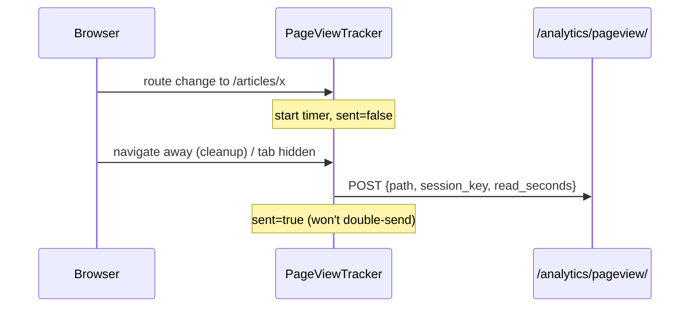

# Client instrumentation, explained — the pageview tracker, beacon & ad pings

Three small frontend files turn a static site into a measured one. None of them
may ever slow down or break a page — analytics is strictly best-effort.

- `lib/analytics-beacon.ts` — the low-level "send a ping" helper + session id.
- `components/public/page-view-tracker.tsx` — one pageview per page visit.
- `components/public/ad-tracking.tsx` — ad impressions and clicks.

## Why it exists

The backend can only report what the browser tells it. Servers don't reliably
know a page was *seen* (caching, prefetch, bots), how long it was read, or that
an ad was clicked. So the measuring has to happen client-side and be shipped to
the ingest endpoints.

## 1. `analytics-beacon.ts` — session id + fire-and-forget POST

- **`sessionId()`** reads/creates a random `flash_sid` in `localStorage`. It's
  the anonymous, cookie-free label used to estimate unique visitors. Wrapped in
  `try/catch` because `localStorage` can throw (private mode, storage full).
- **`beacon(path, body)`** does `fetch(url, { keepalive: true })` with a JSON
  body and swallows every error.
  - **Why `keepalive` and not `navigator.sendBeacon`?** `sendBeacon` can't set
    `Content-Type: application/json`, and a JSON blob would trip a CORS preflight
    it can't perform — cross-origin in dev (`:3000 → :8000`) that silently
    fails. `fetch(keepalive:true)` sends a proper CORS request the DRF endpoint
    parses, and still survives a tab closing.

## 2. `page-view-tracker.tsx` — exactly one pageview per visit, with dwell

Mounted once in the **site** layout (so only the public site is measured, never
the admin). It uses three refs — the current `path`, a `start` timestamp, and a
`sent` guard — and one effect keyed on `usePathname()`:

- On a new path: reset the timer and clear the `sent` guard.
- `flush()` sends `{ path, referrer, session_key, read_seconds }` **once** (the
  guard prevents double counting).
- It flushes on three triggers: the effect **cleanup** (client-side navigation
  away), `visibilitychange → hidden`, and `pagehide` (tab close). A SPA doesn't
  fire a real unload on in-app navigation, so the cleanup is the main path and
  the listeners catch the very last page.

The tracker sends only the **path**, not an article id — the server recovers the
article from the URL (`_top_articles`). One less thing for the client to know.

**Excluding staff from "visitors."** Newsroom staff constantly browse their own
site, which would inflate the numbers. The pageview beacon attaches the caller's
JWT (`{ auth: true }`) *when present*, and the ingest view authenticates
**leniently**: a valid editorial-staff token → the view returns `204` and stores
nothing; a missing, expired or invalid token → treated as an anonymous visitor
and recorded. Doing the role check on the **server** (not the client) is what
makes it trustworthy — the browser can't just claim "I'm not staff" — and the
lenient auth means a logged-in *reader* (a subscriber) with a stale access token
is never accidentally dropped. This is why `PageViewIngestView` sets
`authentication_classes = []` and calls `JWTAuthentication` itself inside a
`try/except`, rather than letting DRF 401 the beacon.

## 3. `ad-tracking.tsx` — impressions & clicks on a server-rendered ad

The `<Ad>` component is an async **server** component, so the interactive bits
live in tiny client components it renders:

- **`AdImpression`** fires `recordAdImpression(id)` in a `useEffect` — so an
  impression counts when the ad actually **mounts in the browser**, not merely
  when the server rendered HTML.
- **`AdLink`** is the outbound `<a>`; its `onClick` calls `recordAdClick(id)`
  before the navigation. `keepalive` means the click ping isn't cancelled when
  the new tab/page starts loading.

Both hit the public `/ads/{id}/impression|click/` endpoints, which do the atomic
`F()` increment.

## Common mistakes

- **Double counting.** Without the `sent` guard, firing on *both* a route change
  and `visibilitychange` would send two rows for one visit. Guard it.
- **Blocking on the beacon.** Never `await` analytics in a click handler or a
  render path; fire and forget.
- **Measuring the admin.** Put the tracker in the `(site)` layout only, or your
  "visitors" include staff clicking around the dashboard.
- **Counting impressions on the server.** Incrementing during server render
  counts prefetches and bots. Count on client mount.
- **StrictMode in dev** double-invokes effects, so you'll see 2 impressions
  locally — that's a dev artifact, not production behaviour.

## Best practices shown here

- Best-effort everywhere (`try/catch`, `.catch(() => {})`) — analytics failures
  are invisible to the reader.
- Anonymous, cookie-free measurement (a random id in `localStorage`, coarse
  referrer buckets) — privacy by design.
- The client sends the minimum (a path); the server does the joining.

## Where to go next

- [services-explained.md](services-explained.md) — how these events become the
  dashboard numbers.
- [ad-tsx-explained.md](../../12-nextjs/project-files/ad-tsx-explained.md) — the
  ad component these pings hook into.
